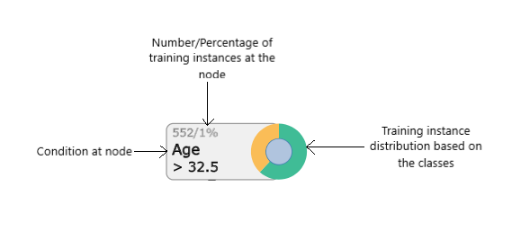

# Decision Tree Visualization

## Overview

Machine Learning has great potential for improving products, processes and research. But computers usually do not 
explain their predictions which is a barrier to the adoption of machine learning. In this project we aim to increase
the interpretability of one such machine learning algorithm "Decision Tree". In order to accomplish this we visualize
the decision tree generated by the python library 'sklearn' using D3.js.

## The Tree

<mark>The complete visualization of tree can be seen 
<i><b><a href="https://bl.ocks.org/thundercat95/raw/5ac59643aabf1ecc74a8a2364c727492/"> here </a></b></i></mark>.

  

A decision tree is a flowchart-like structure in which each internal node represents a condition and each edge 
represents the outcome of an instance for that condition. In this project we will create a decision tree for the 
<a href = "https://archive.ics.uci.edu/ml/datasets/Adult"> Adult dataset</a> using 
<a href="https://scikit-learn.org/stable/modules/generated/sklearn.tree.DecisionTreeClassifier.html">
sklearn's DecisionTreeClassifier</a>. The decision tree classifies individual based on their income ($>50K or $<=50K). 
The resultant tree is then visualized using <a href = "https://d3js.org/">D3.js</a>. Each node in the interactive 
visualization is represented as shown in the figure above. Clicking the node will expand/condense the tree. 
<mark>The complete visualization of tree can be seen 
<i><b><a href="https://bl.ocks.org/thundercat95/raw/5ac59643aabf1ecc74a8a2364c727492/"> here </a></b></i></mark>.

## Part of something bigger

This project is part of a bigger project which will help users (specially data scientist) to better understand the 
behaviour of supervised machine learning models. A RESTful API is under development which is being built using 
frameworks like Django, React.js and D3.js.

